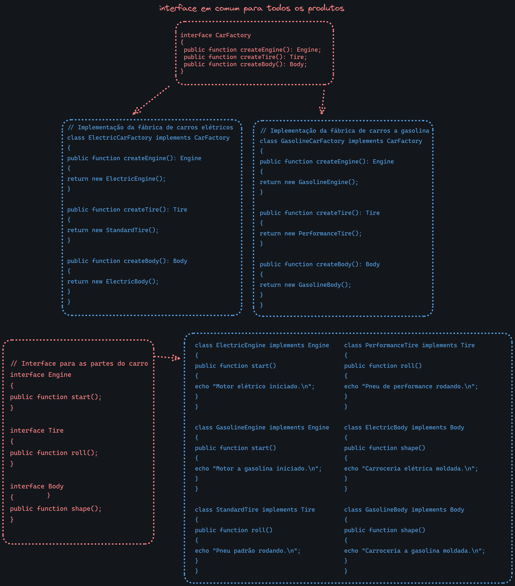
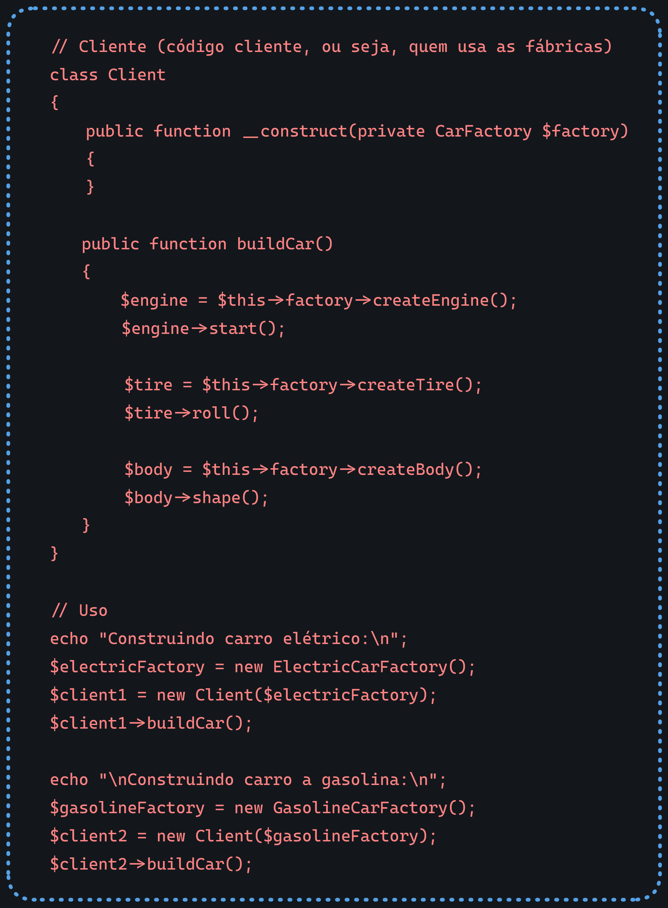

# Propósito

Propor uma interface para criar famílias de objetos relacionados ou dependentes sem especificar suas classes concretas.

Por exemplo, no caso do nosso exemplo [Example1.php](Example1.php), temos a interface `CarFactory` que define os métodos `createEngine`, `createTire` e `createBody`. As classes `ElectricCarFactory` e `GasolineCarFactory` implementam a interface `CarFactory` e sobrescrevem os métodos para retornar objetos diferentes em cada caso.

# Aplicabilidade

Use o padrão Abstract Factory quando:
	- Um sistema deve ser independente de como seus produtos são criados, compostos e representados.
	- Um sistema deve ser configurado com uma família de produtos.
	- Uma família de objetos for projetada para ser usada em conjunto e você necessita garantir essa restrição

# Implementação

1. Crie uma interface em comum para todos os produtos (por exemplo, `CarFactory`).
2. Crie classes que implementam a interface e definem os métodos Factory Method (por exemplo, `ElectricCarFactory` e `GasolineCarFactory`).
3. Crie classes concretas que implementam a interface e sobrescrevem os métodos Factory Method (por exemplo, `ElectricEngine`, `GasolineEngine`, `StandardTire`, `PerformanceTire`, `ElectricBody` e `GasolineBody`).
4. Crie uma classe cliente que usa a interface para criar objetos (por exemplo, `Client`).

  

  

Exemplos:
	- [AbstractFactory.php](AbstractFactory.php)
	- [Example1.php](Example1.php)
	- [AbstractFactoryTest.php](../../../tests/Patterns/Creational/AbstractFactory/AbstractFactoryTest.php)
