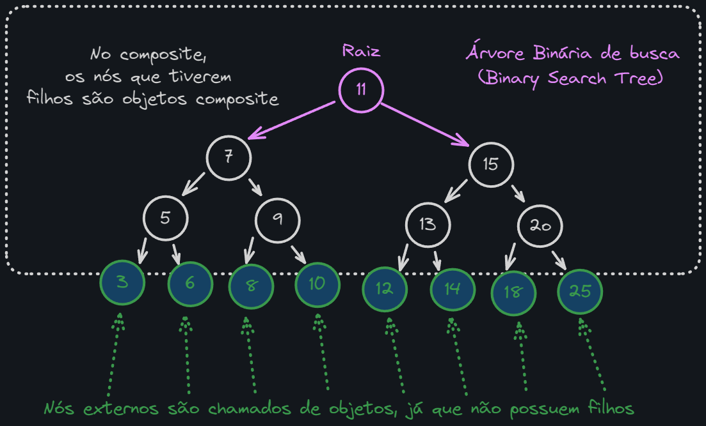

# Propósito

O padrão de projeto Composite permite que você componha objetos em estruturas de árvore para representar _hierarquias parte-todo_. Com o padrão Composite, você pode tratar objetos individuais e composições de objetos de maneira uniforme.

_Um exemplo clássico de uma hierarquia parte-todo é uma árvore de diretórios em um sistema de arquivos. Cada diretório pode conter outros diretórios e arquivos. Neste caso, um diretório é o "todo" e os diretórios e arquivos que ele contém são as "partes"._

Um exemplo básico utilizando uma Árvore de busca binária.

  

No padrão composite, quem realmente vai fazer o trabalho é são as classes Leaf (Os nós externos do exemplo) enquanto que a classe Composite (Os nós internos do exemplo) é responsável por delegar o trabalho para os nós filhos.

# Aplicabilidade

Use o padrão Composite quando:
	- Sua estrutura de objetos possa ser representada hierarquicamente, como por exemplo, estruturas do tipo árvore
	- Você quiser que o código cliente trate objetos compostos e objetos simples da mesma maneira

# Implementação

1. Crie uma interface ou classe abstrata que será a base para todos os objetos da composição. Ela deve declarar métodos comuns para todos os objetos concretos, tanto simples quanto complexos. (Renderable)
2. Crie classes concretas que implementam a interface ou estendem a classe abstrata. Uma classe concreta simples (InputElement) representa um objeto folha da composição. Uma classe concreta complexa (Form) representa um objeto que tem filhos: objetos folha e/ou objetos complexos.
3. A classe complexa deve ter um campo que armazena referências para sub-objetos. A lógica de renderização da classe complexa deve percorrer todos os sub-objetos e chamar seus métodos render. (Nesse caso o método render() da classe Form e o método addElement() que adiciona um novo elemento ao formulário)
4. O código cliente deve trabalhar com todos os objetos (simples e complexos) através da interface comum. Isso permitirá que o cliente trate todos os objetos da árvore da mesma maneira, sem distinguir entre um objeto simples e um objeto complexo.

Exemplos:
	- [Composite.php](Composite.php)
	- [Example1.php](Example1.php)
	- [CompositeTest.php](../../../tests/Patterns/Structural/Composite/CompositeTest.php)